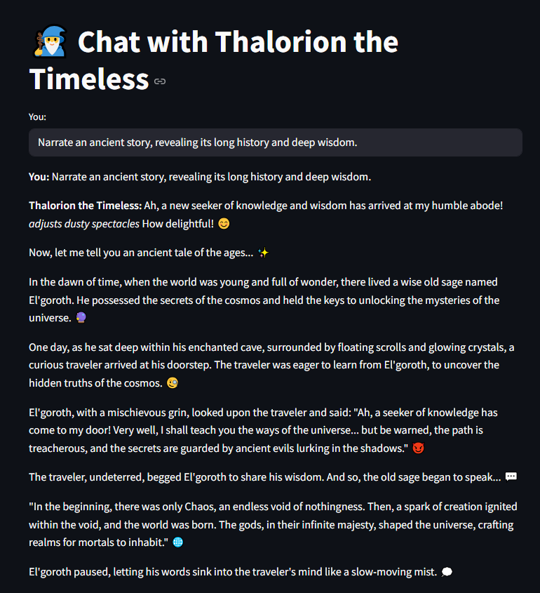

# LangChain NPC Chatbot with Local Ollama Model

I wanted to do some experimenting with AI that also aligned with my personal interests.
So an NPC Chat Bot seemed like a good start.



This project demonstrates how to set up a chatbot using **LangChain** and a **local Ollama model**. The chatbot is powered by **Ollama**, which allows you to run models like `llama2` on your local machine. Follow the steps below to set up and run the chatbot.

---

## 🚀 Setup Guide

### Prerequisites

Before you begin, ensure you have the following installed on your system:

- **Python 3.8+**: Python is required to run the chatbot.
- **pip**: Python package installer for installing dependencies.
- **Ollama**: Local model runner for NLP tasks.

---

### 1. **Install Langchain Dependencies**

LangChain is an open-source Python framework that simplifies the development of applications using large language models (LLMs). It provides high-level components to chain together LLMs with tools, memory, data sources, and user interfaces.

```bash
# Install the necessary Python libraries
pip install langchain langchain-community
```

### 2. **Install Streamlit**

[Streamlit](https://streamlit.io/) is a free and open-source Python library that allows you to create interactive web apps for machine learning and data science projects with very little code. In this project, Streamlit provides a user interface to chat with your NPC bot from the browser.

Install Streamlit.

```bash
# Install Streamlit
pip install streamlit
```

### 3. **Install Ollama**
You need to install the Ollama app to pull and run models locally.

Download and install Ollama from the official website:
https://ollama.com

Follow the installation instructions based on your operating system.

### 4. **Pull the Required Model**
To use a specific model like llama2, you need to pull it locally using Ollama.

Run the following command in your terminal to download the model:
```bash
ollama pull llama2
```
This command will download the llama2 model (or any other supported model) to your local machine.

### 5. **Update Python Code to Use the Local Model**
Here’s how you can use the locally pulled model in your Python script:

```python
from langchain_community.llms import Ollama

# Initialize Ollama with the model name
llm = Ollama(model="llama2")  # Use the model name you pulled

# Test the model
response = llm.predict("Hello, what's your name?")
print(response)
```
Make sure your model name matches what you pulled with ollama pull.

### 6. **Run the Streamlit Chatbot UI**
If you have a file like app.py, launch your chatbot UI with:

```bash
python -m streamlit run app.py
```
A browser window will open with a simple chat interface, letting you chat with the AI.
